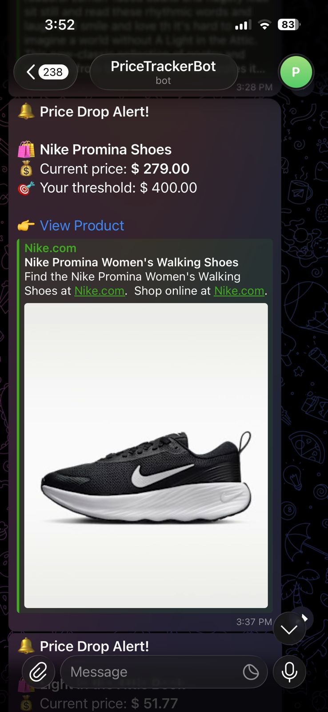
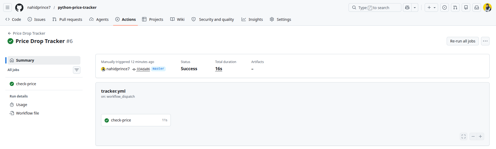

# Price Drop Tracker — Installation Guide

A complete guide to set up, run, and automate the Price Drop Tracker on Ubuntu/Linux.



---

## Prerequisites

- Ubuntu 20.04 or later
- Google Chrome installed
- Python 3.10 or later
- A Telegram account

---

## Step 1 — Create a Telegram Bot

1. Open Telegram → search `@BotFather`
2. Send `/newbot`
3. Give it a name (e.g. `PriceTrackerBot`)
4. Copy the token BotFather gives you — looks like:
   ```
   7412345678:AAFxxxxxxxxxxxxxxxxxxxxxxxxxxxxxx
   ```
   This is your `TELEGRAM_BOT_TOKEN`

### Get your Chat ID

1. Send any message to your new bot (e.g. `/start`)
2. Visit this URL in your browser (replace `YOUR_TOKEN`):
   ```
   https://api.telegram.org/botYOUR_TOKEN/getUpdates
   ```
3. Find `"chat":{"id": 123456789}` in the response
4. That number is your `TELEGRAM_CHAT_ID`

---

## Step 2 — Create Project Folder

```bash
mkdir -p ~/Projects/price-tracker
cd ~/Projects/price-tracker
```

---

## Step 3 — Install Python Virtual Environment

```bash
# Install venv support (Ubuntu requires this)
sudo apt install python3.12-venv

# Create virtual environment
python3 -m venv venv

# Activate it
source venv/bin/activate
```

> Your terminal prompt will change to show `(venv)` — this means it's active.

---

## Step 4 — Install Dependencies

```bash
pip install requests beautifulsoup4 python-dotenv selenium webdriver-manager

# Optional — for Cloudflare-protected sites (Shopee, etc.)
pip install cloudscraper

# Optional — for heavy JS sites (better than Selenium)
pip install playwright
playwright install chromium
```

Save your installed versions:

```bash
pip freeze > requirements.txt
```

---

## Step 5 — Create `.env` File

```bash
nano .env
```

Paste and fill in your values:

```env
TELEGRAM_BOT_TOKEN=your_bot_token_here
TELEGRAM_CHAT_ID=your_chat_id_here

PRODUCT_1_URL=https://books.toscrape.com/catalogue/a-light-in-the-attic_1000/index.html
PRODUCT_1_THRESHOLD=60.00
PRODUCT_1_NAME=Book Example

PRODUCT_2_URL=https://www.nike.com/my/t/promina-walking-shoes-CsDWSZ/FV6343-002
PRODUCT_2_THRESHOLD=400.00
PRODUCT_2_NAME=Nike Promina Shoes
```

Save: `Ctrl+O` → Enter → `Ctrl+X`

> Add as many products as you want by incrementing the number (PRODUCT_3, PRODUCT_4, etc.)

---

## Step 6 — Create `tracker.py`

```bash
nano tracker.py
```

Paste the full script content, then save: `Ctrl+O` → Enter → `Ctrl+X`

---

## Step 7 — Create `.gitignore`

```bash
nano .gitignore
```

Add these lines:

```
.env
venv/
__pycache__/
*.pyc
debug_screenshot.png
```

Save: `Ctrl+O` → Enter → `Ctrl+X`

---

## Step 8 — Test the Script

```bash
python3 tracker.py
```

Expected output:

```
====================================================
  Price Drop Tracker — 2 product(s) to check
====================================================

🔍 Nike Promina Shoes
   https://www.nike.com/my/t/...
   ⚙️  Detected JS-rendered site → using Selenium
   ✅ Price found via: [data-test='product-price']
   💲 Current price:  379.00
   🎯 Threshold:      400.00
   📉 BELOW threshold! Sending alert...
   ✅ Telegram alert sent!
```

---

## Step 9 — Push to GitHub

```bash
git init
git add .
git commit -m "feat: add price drop tracker"
git remote add origin https://github.com/YOUR_USERNAME/price-tracker.git
git push -u origin main
```

---

## Step 10 — Add GitHub Secrets

So your tokens are never exposed in code:

1. Go to your GitHub repo
2. Click **Settings** → **Secrets and variables** → **Actions**
3. Click **New repository secret** and add:

| Name | Value |
|------|-------|
| `TELEGRAM_BOT_TOKEN` | Your bot token |
| `TELEGRAM_CHAT_ID` | Your chat ID |

---

## Step 11 — Set Up GitHub Actions (Auto-run daily)

Create the workflow file:

```bash
mkdir -p .github/workflows
nano .github/workflows/tracker.yml
```

Paste this:

```yaml
name: Price Drop Tracker

on:
  schedule:
    - cron: "0 9 * * *"   # Runs at 09:00 UTC every day
  workflow_dispatch:        # Also allows manual trigger from GitHub UI

jobs:
  check-price:
    runs-on: ubuntu-latest

    steps:
      - name: Checkout repository
        uses: actions/checkout@v4

      - name: Set up Python 3.11
        uses: actions/setup-python@v5
        with:
          python-version: "3.11"

      - name: Install Chrome
        uses: browser-actions/setup-chrome@v1

      - name: Install dependencies
        run: pip install -r requirements.txt

      - name: Run price tracker
        env:
          TELEGRAM_BOT_TOKEN: ${{ secrets.TELEGRAM_BOT_TOKEN }}
          TELEGRAM_CHAT_ID: ${{ secrets.TELEGRAM_CHAT_ID }}
        run: python tracker.py
```

Save: `Ctrl+O` → Enter → `Ctrl+X`

Commit and push:

```bash
git add .github/
git commit -m "feat: add GitHub Actions workflow"
git push
```

---

## Daily Usage

### Start the tracker

```bash
cd ~/Projects/price-tracker
source venv/bin/activate
python3 tracker.py
```

### Stop the tracker

```
Ctrl + C
```

### Deactivate virtual environment

```bash
deactivate
```

### Optional — create a shortcut alias

Run this once to add a `tracker` command to your terminal:

```bash
echo "alias tracker='cd ~/Projects/price-tracker && source venv/bin/activate && python3 tracker.py'" >> ~/.bashrc
source ~/.bashrc
```

Now just type `tracker` anywhere to start it.

---

## Adding New Products

Just append to your `.env` file:

```env
PRODUCT_3_URL=https://www.lazada.com.my/your-product-url
PRODUCT_3_THRESHOLD=299.00
PRODUCT_3_NAME=Lazada Headphones
```

No code changes needed — ever.

---

## Supported Site Types

| Site Type | Method Used | Examples |
|-----------|-------------|---------|
| Plain HTML | requests | books.toscrape.com, Harvey Norman |
| JavaScript-rendered | Selenium | Nike, Lazada, Zalora, Amazon |
| Cloudflare-protected | cloudscraper | Shopee |
| Heavy JS | Playwright | Complex SPAs |

The script auto-detects which method to use based on the domain. If one method fails, it automatically falls back to another.

---

## Troubleshooting

### `externally-managed-environment` error
```bash
sudo apt install python3.12-venv
python3 -m venv venv
source venv/bin/activate
```

### Price not found
```bash
# Take a screenshot to see what the browser loaded
# Check debug_screenshot.png in your project folder
xdg-open debug_screenshot.png
```

### Empty result from getUpdates
- Make sure you sent a message to your bot first
- Search your bot name in Telegram and press Start

### Selenium crashes
```bash
# Make sure Chrome is installed
google-chrome --version

# Reinstall webdriver-manager
pip install --upgrade webdriver-manager
```

---

## Project Structure

```
price-tracker/
├── .github/
│   └── workflows/
│       └── tracker.yml      ← GitHub Actions (auto-run daily)
├── venv/                    ← Virtual environment (never commit)
├── tracker.py               ← Main script
├── requirements.txt         ← Locked dependency versions
├── .env                     ← Your secrets (never commit)
└── .gitignore               ← Excludes .env and venv/
```

---

## Security Reminders

- Never commit your `.env` file
- Never share your `TELEGRAM_BOT_TOKEN` publicly
- If your token is exposed, revoke it immediately via `@BotFather` → `/revoke`
- Always store tokens as GitHub Secrets for automated runs